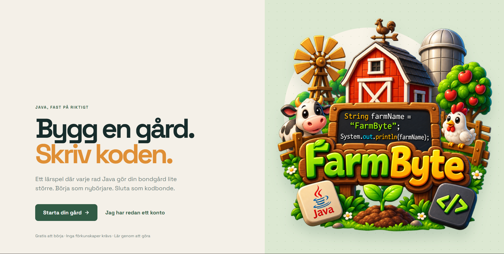
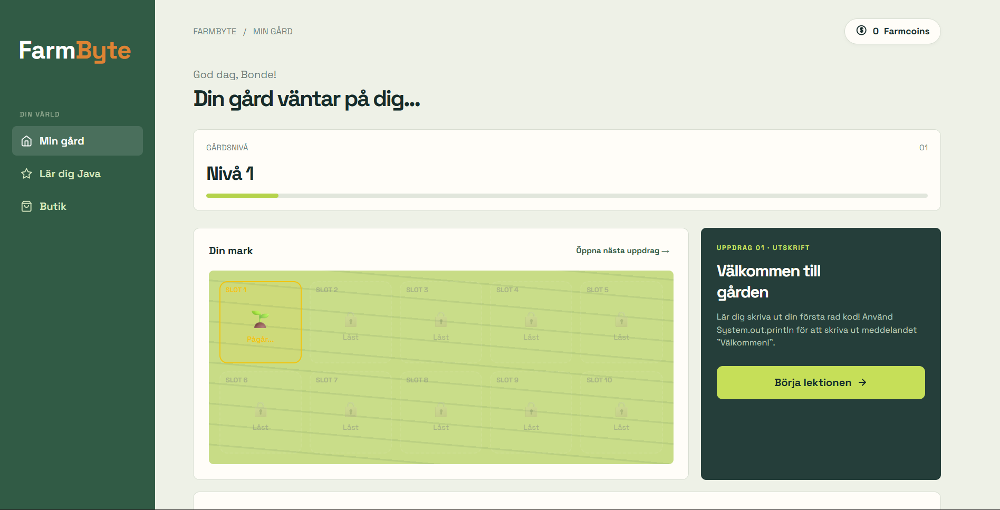

# FarmByte

FarmByte är ett webbaserat, gamifierat lärspel där du lär dig grunderna i programmeringsspråket Java genom att bygga och utveckla din egen bondgård.

# Funktioner
8 Interaktiva Java-uppdrag: Lär dig allt från System.out.println(), datatyper (String, int, boolean), for-loopar, arrayer, metoder, klasser/objekt till while-loopar.

Visuell Gårdsutveckling: Din gård växer och förändras direkt på skärmen allt eftersom du klarar nya lektioner.

Belöningssystem & Butik: Tjäna Farmcoins för varje avklarat uppdrag och lås upp nya utseenden (skins) till din bonde.

Inbyggd Kodeditor & Validering: Skriv din Java-kod direkt i webbläsaren med inbyggd validering och hjälpsamma hintar.

Spara Framsteg: Din spelsession och dina upplåsta föremål sparas automatiskt i webbläsarens localStorage.

Ren & Responsiv Design: Fullt anpassad för både dator och mobila enheter, uppbyggd helt med vektorikoner (SVG).

# Tekniker
HTML5 & CSS3: Flexbox, CSS Grid och anpassade CSS-variabler för stil och layout.

JavaScript (Vanilla ES6): Ingen externa bibliotek eller ramverk krävs.

SVG: Vektorikoner för ren och snabb grafik.

Web Storage API: localStorage för hantering av användardata och spelstatus.

# Spelupplägg & Lektioner

Uppdrag 01: Skapa din första String-variabel och skriv ut gårdens namn.

Uppdrag 02: Hantera heltal (int) för att plantera frön.

Uppdrag 03: Använd boolean för att bevattna grödorna.

Uppdrag 04: Räkna skörden med en for-loop.

Uppdrag 05: Organisera dina grödor i en String[]-array.

Uppdrag 06: Skapa en metod (vattnaAker()) för att automatisera bevattningen.

Uppdrag 07: Skapa klasser och objekt för dina djur på gården.

Uppdrag 08: Sälj din skörd på torget med en while-loop och tjäna guld.
